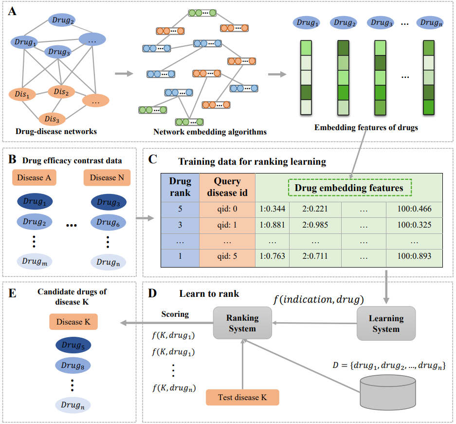

#  DRONet: Effectiveness-driven drug repositioning framework using network embedding and ranking learning
## 1. Introduction
This repository contains source code and datasets for paper "DRONet: Effectiveness-driven drug repositioning framework using network embedding and ranking learning". In this study, we proposed a drug repositioning framework termed DRONet, which make full use of effectiveness contrast relationships among drugs by combining network embedding and ranking learning. We utilized network embedding methods to learn the deep features of drugs from a heterogeneous drug-disease network, and constructed a high-quality drug-indication data set including effectiveness-based drug contrast relationships. The embedding features and effectiveness contrast relationships of drugs are combined effectively through a designed ranking learning model to prioritize candidate drugs.
## 2. Overview


Fig. 1. Overview of drug repositioning framework. (A) Drug-disease networks and network embedding. (B) Drug effectiveness contrast data. (C) Training data for ranking learning. (D) Learn to rank algorithms. (E) Predicted candidate drugs of test disease.
## 3.Install Python libraries needed
```bash
$ conda create -n NE python=3.7
$ conda activate NE
$ pip install -r requirements.txt
```
## 4.Methods
The network embedding learning uses the code from [BioNEV](https://github.com/xiangyue9607/BioNEV). The code of [learning to rank](https://github.com/haowei01/pytorch-examples) is from their authors. To ensure different source code could run successfully in our framework, we modify part of their source code.
### 4.1 Network Embedding for the features of drugs and diseases
#### 4.1.1 Dataset
- graph_dis_drug.edgelist：a curated drug-phenotype association data from SemMed Database.
- graph_dis.edgelist：a phenotype-phenotype association data that utilizes cosine similarity to obtain gene-based disease similarity.
- graph_drug.edgelist：a drug-drug association data that utilizes cosine similarity to obtain target-based drug similarity
#### 4.1.2 Running
```
nohup python -u main.py --method DeepWalk --input '../../mydata2/graph+dis+drug.edgelist' --output '../../result/DeepWalk/graph+dis+drug_100_embeddings.txt' > DeepWalk.txt 2>&1 &
```
- --input, input graph file. Only accepted edgelist format.
- --output, output graph embedding file.
- --method, the name of embedding method. (i.e.,GF, GraRep, HOPE, DeepWalk, node2vec,  LINE, SDNE, GAE)
- --testing-ratio, testing set ratio for prediction tasks. Only applied when --task is not none. The default is 0.2
- --dimensions, the dimensions of embedding for each node. The default is 100.
- --method, the name of embedding method.
- --label-file, the label file for node classification.
- --weighted, true if the input graph is weighted. The default is False.
- --eval-result-file, the filename of eval result (save the evaluation result into a file). Skip it if there is no need.
- --seed, random seed. The default is 0.
- --kstep, k-step transition probability matrix for GraRep. The default is 4. It must divide the --dimension.
- --weight-decay, coefficient for L2 regularization for Graph Factorization. The default is 5e-4.
- --lr, learning rate for gradient descent in Graph Factorization. The default is 0.01.
- --number-walks, the number of random walks to start at each node.
- --walk-length, the length of the random walk started at each node.
- --window-size, window size of node sequence. 
- --p, --q, two parameters that control how fast the walk explores and leaves the neighborhood of starting node. The default values of p, q are 1.0.
- --OPT1, --OPT2, --OPT3, three running time efficiency optimization strategies for struc2vec. The default values are True.
- --until-layer, calculation until the layer. A hyper-parameter for struc2vec. The default is 6.
- --lr, learning rate for gradient descent. The default is 0.01.
- --epochs, training epochs. The default is 5. Suggest to set a small value for LINE and SDNE (e.g., 5), and a large value for GAE (e.g., 500).
- --bs, batch size. Only applied for SDNE. The default is 200.
- --negative-ratio, the negative sampling ratio for LINE. The default is 5.
- --order, the order of LINE, 1 means first order, 2 means second order, 3 means first order + second order. The default is 2.
- --alpha, a hyperparameter in SDNE that balances the weight of 1st-order and 2nd-order proximities. The default is 0.3.
- --beta', a hyperparameter in SDNE that controls the reconstruction weight of the nonzero elementsin the training graph. The default is 0.
- --dropout, dropout rate. Only applied for GAE. The default is 0.
- --hidden, number of units in hidden layer. Only applied for GAE. The default is 32.
- --gae_model_selection, GAE model variants: gcn_ae or gcn_vae. The default is gcn_ae.
### 4.2  Learn to rank for predicting drug indication
#### 4.2.1 Dataset
- train_1v5.txt：A training dataset of learning to rank where the ratio of positive and negative samples is 1:5
- test_1v5.txt：A test dataset of learning to rank where the ratio of positive and negative samples is 1:5
#### 4.2.3 Running
```
nohup python -u main.py --method LambdaRank --input_train './mydata2/train_1v5.txt' --input_test './mydata2/test_1v5.txt' --output './resultdata/LambRank/example_LambRank_1v5.txt'> test_res.txt 2>&1 &
```
- --method, the learning to rank method (i.e., LambdaMART, LambdaRank, RankNet).
- --number, the number of regression tree. The default is 0.2
- --lr_LM, learning rate of LambdaMART. The default is 0.0005.
- --h1_units, the first hidden layer. The default is 512.
- --h2_units, the first hidden layer. The default is 256.
- --epochs, the training epochs of LambdaRank. The default is 100.
- --lr_LR, learning rate of LambdaRank.The default is 0.0005.
- --k, used to compute the NDCG@k. The default is 10.
- --start_epoch. The default is 0.
- --additional_epoch. The default is 100.
- --lr_RN, learning rate of RankNet. The default is 0.0005.
- --optim, optimizer (i.e., adam, sgd). The default is adam.
- --leaky_relu, activation function.
- --ndcg_gain_in_train. The default is exp2.
- --small_dataset. The default is False.
- --debug. The default is False.
- --double_precision. The default is False.
- --standardize. The default is False.
- --output_dir The default is "/tmp/ranking_output/".
- --train_algo. The default is SUM_SESSION.

## 5. Experimental results


